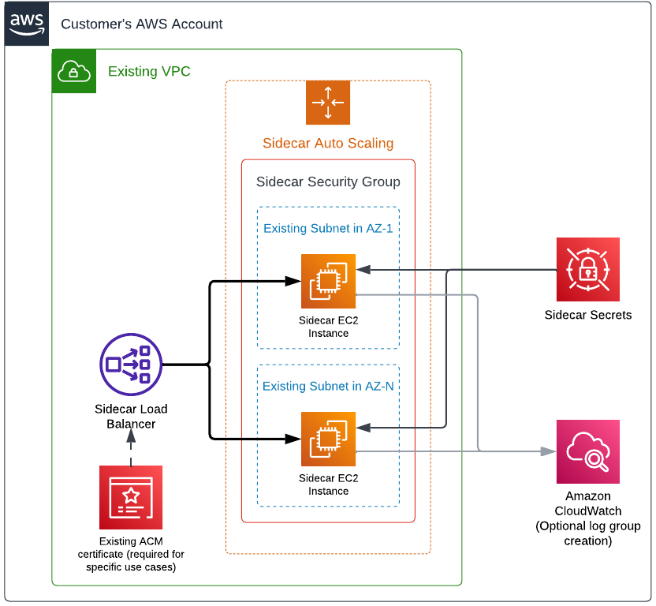

# Sidecar - Terraform AWS EC2

A quick start to deploy a sidecar to AWS EC2 using Terraform!

## Architecture



## Deployment

The elements shown in the [architecture diagram](#architecture) are deployed by the [Cyral Sidecar module for AWS EC2](https://registry.terraform.io/modules/cyralinc/sidecar-ec2/aws/latest). The module requires existing VPC and subnets in order to create the necessary components for the sidecar to run. In a high-level, these are the resources deployed:

* EC2
    * Auto scaling group (responsible for managing EC2 instances and EBS volumes)
    * Network load balancer
    * Security group
* Secrets Manager
    * Sidecar credentials (optionally created)
    * Sidecar CA certificate
    * Sidecar self-signed certificate
* IAM
    * Sidecar role
* Cloudwatch
    * Log group (optionally created)

### Requirements

* Make sure you have access to your AWS environment with an account that has sufficient permissions to deploy the sidecar. The minimum permissions must allow for the creation of the elements listed previously. We recommend Administrator permissions (`AdministratorAccess` policy) as the module creates an IAM role.
* Install and configure the AWS CLI.
* Install [Terraform](https://www.terraform.io).

See the Terraform module's requirements in file [versions.tf](https://github.com/cyralinc/terraform-aws-sidecar-ec2/blob/main/versions.tf).

### Examples

#### Quickstart

```hcl
provider "aws" {
  # Define the target AWS region
  region = "us-east-1"
}

module "cyral_sidecar" {
  source  = "cyralinc/sidecar-ec2/aws"  
  version = "~> 4.0" # terraform module version

  sidecar_id    = ""
  control_plane = ""
  client_id     = ""
  client_secret = ""

  # Considering MongoDB ports are from the range 27017 to 27019
  sidecar_ports = [443, 3306, 5432, 27017, 27018, 27019]

  vpc_id  = "<vpc-id>"
  subnets = ["<subnet-id>"]

  #############################################################
  #                       DANGER ZONE
  # The following parameters will expose your sidecar on the
  # internet. This is a quick set up to test with databases
  # with dummy data. Never use this configuration if you are
  # binding your sidecar to a database containing any data you
  # would not want to expose on the internet.

  # Associate a public IP address to the EC2 instances
  associate_public_ip_address = true
  # Create an internet-facing load balancer
  load_balancer_scheme = "internet-facing"

  # Unrestricted inbound to SSH into EC2 instances
  ssh_inbound_cidr        = ["0.0.0.0/0"]
  # Unrestricted inbound to ports defined in `sidecar_ports`
  db_inbound_cidr         = ["0.0.0.0/0"]
  # Unrestricted inbound to monitor EC2 instances (port 9000)
  monitoring_inbound_cidr = ["0.0.0.0/0"]
  #############################################################
}
```

#### Production Starting Point

```hcl
provider "aws" {
  # Define the target AWS region
  region = "us-east-1"
}

module "cyral_sidecar" {
  source  = "cyralinc/sidecar-ec2/aws"  
  version = "~> 4.0" # terraform module version

  sidecar_id    = ""
  control_plane = ""
  client_id     = ""
  client_secret = ""
  
  # Assign the version that will be used by the sidecar instances.
  # Remove the parameter should you prefer to perform upgrades 
  # directly from the control plane.
  sidecar_version = ""

  # Considering MongoDB ports are from the range 27017 to 27019
  sidecar_ports = [443, 3306, 5432, 27017, 27018, 27019]

  # Use 2 instances `m5.large`
  instance_type = "m5.large"
  asg_min = 1
  asg_desired = 2
  asg_max = 4

  vpc_id  = "<vpc-id>"
  # For production use cases, provide multiple subnets in
  # different availability zones.
  subnets = [
    "<subnet-az1-id>",
    "<subnet-az2-id>",
    "<subnet-azN-id>"
  ]

  associate_public_ip_address = false
  load_balancer_scheme = "internal"
  enable_cross_zone_load_balancing = true

  # Restrict the inbound to SSH into the EC2 instances
  ssh_inbound_cidr        = ["0.0.0.0/0"]
  # Restrict the inbout to ports defined in `sidecar_ports`
  db_inbound_cidr         = ["0.0.0.0/0"]
  # Restrict the inbound to monitor the EC2 instances (port 9000)
  monitoring_inbound_cidr = ["0.0.0.0/0"]
}
```
